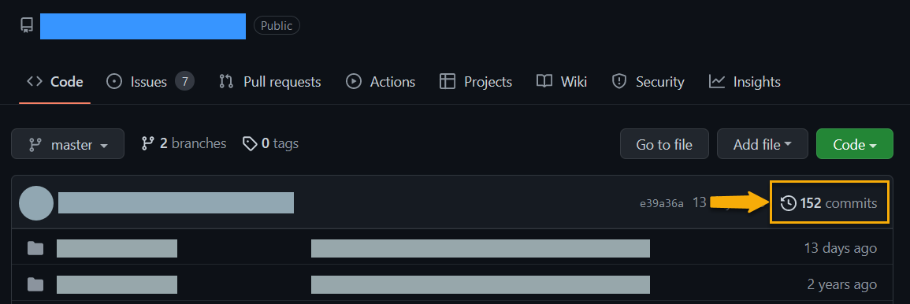
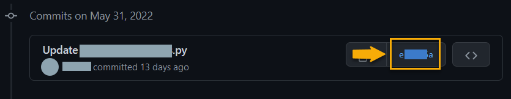
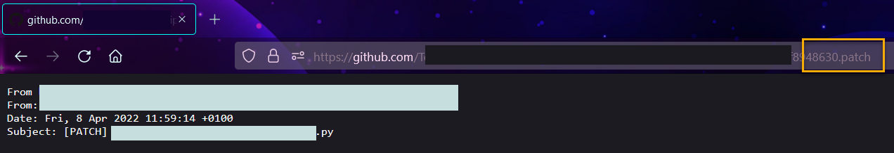

# Privacy & OSINT: GitHub Email Addresses

GitHub has several email address options. At the account level there is a primary address for signing into the website, plus secondary emails that can be used for account security, displaying on the Profile, authenticating with SSH, making commits, and so on. 

Recently I made a digital purchase via a large platform. There was an issue with the file I felt the developer would want to know about ASAP. I didn't want to go through the platform or the devloper's social media links. I know them on GitHub, but they don't display an email address on their profile. 

A quick search suggested checking the user's commits and, sure enough, the developer was using an obviously real email address - which would have been wrong to use in this context. Then I realized just how dumb I'd been with my own account. Here's how I fixed it and how to keep your email private on GitHub. 

## Find a User's Email Address

If the user's settings allow it, searching commits for email addresses is ridiculously easy: 

1. Locate desired account on GitHub.
2. Navigate to reop the user owns - not a forked repository. 
3. Click the `Commits` link to see a list of commits.

4. Click on a commit's alphanumeric hash link.

5. Add `.patch` to the end of the URL. 
6. This view starts with a header that includes the commiter's email address.

## Commit Email Done Right

Even if you're using an anonymized eamil address for your account, there are good reasons to prevent it from being used in commits. These steps cover commits made from both the website and when pushed from your local machine: 

1. User menu > Settings > Left panel > Emails.
1. Check **Keep my emails private**.
1. Check **Block command line pushes that expose my email**.

This sets your commit address to `username@users.noreply.github.com`.

